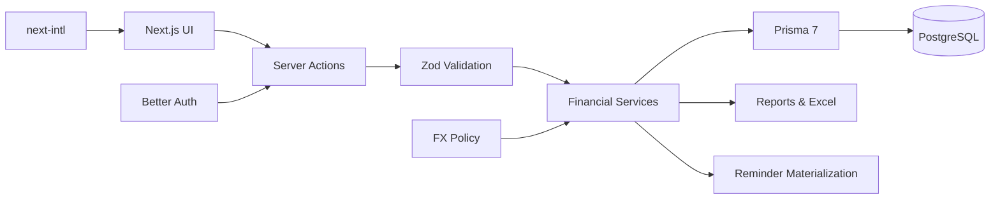

<div align="center">
  
  <br /><br />

  [](https://github.com/thiennvu1914/CashFlow/actions/workflows/ci.yml)
  
  
  
  
  

  <br />
  <strong>Personal finance with clear money flows, reliable accounting rules, and a calm everyday experience.</strong>
</div>

## Overview

**CashFlow** is a modern personal-finance web application for recording day-to-day money movement, planning ahead, and understanding financial position from one place.

It combines **accounts, transactions, transfers, budgets, savings goals, debts, loans, reminders, reports, and Excel export** in a bilingual Vietnamese/English interface with light and dark themes. Each user gets an isolated financial workspace, while authoritative money rules remain on the server instead of being trusted to client state.

The project is intentionally built as a well-structured **Next.js monolith**: simple to operate, but hardened with PostgreSQL, Prisma, Better Auth, validation, automated tests, Docker release images, health checks, and GitHub Actions.

## At a Glance

| Money | Planning | Insight | Experience |
|---|---|---|---|
| **Accounts & transactions** | **Budgets & savings** | **Dashboard & reports** | **Vietnamese / English** |
| Internal transfers | Debts & loans | Historical FX-aware views | Light / dark theme |
| VND & USD | Recurring reminders | Excel export | Responsive desktop / mobile |
| Derived balances | Manual goal progress | Net Worth | Secure per-user workspace |

## Product Experience

<table>
  <tr>
    <td width="50%" valign="top">
      <h3>💳 Track everyday money</h3>
      <p>Create financial accounts, record income and expenses, make internal transfers, organize categories, and keep balances derived from real financial activity.</p>
    </td>
    <td width="50%" valign="top">
      <h3>🎯 Plan without moving money silently</h3>
      <p>Budgets and savings goals help plan ahead while remaining separate from actual account balances. Planning modules never create hidden cash movement.</p>
    </td>
  </tr>
  <tr>
    <td width="50%" valign="top">
      <h3>🤝 Manage obligations</h3>
      <p>Track receivables, payables, loans, principal payments, due dates, payment history, and reminders with derived outstanding balances.</p>
    </td>
    <td width="50%" valign="top">
      <h3>📊 Understand the full picture</h3>
      <p>Review Net Worth, monthly income and expense, cash-flow trends, category spending, balance history, budget progress, savings progress, and recent activity.</p>
    </td>
  </tr>
</table>

## Core Capabilities

| Area | What CashFlow supports |
|---|---|
| **Accounts** | Name, type, initial balance, fixed account currency, description, active/archive state, derived current balance |
| **Transactions** | Income, expense, cash in/out, balance adjustments, categories, date/time, notes, immutable FX entry snapshot |
| **Transfers** | Separate internal-transfer flow; same-currency value conservation and FX-aware cross-currency movement |
| **Categories** | Default and custom income/expense categories with active/archive semantics |
| **Budgets** | Monthly overall and category-specific budgets with progress and threshold states |
| **Savings** | Manual savings goals with current amount, target amount, and optional deadline |
| **Debts** | Receivables/payables, payment history, derived outstanding amount, due-date tracking |
| **Loans** | Principal tracking, principal/interest payments, derived outstanding principal, due-date behavior |
| **Reminders** | One-time, weekly, monthly, and yearly reminders with timezone-aware occurrence materialization |
| **Dashboard** | Total balances, Net Worth, monthly income/expense, Net Income, trends, categories, planning summaries, reminders |
| **Reports** | Day, week, month, quarter, year, and custom periods with timezone-safe boundaries |
| **Export** | Filtered Excel export and a full multi-sheet financial workbook |
| **Preferences** | Vietnamese/English, light/dark theme, base display currency, timezone |
| **Authentication** | Register, login, logout, forgot/reset/change password, profile management |

## Financial Model

CashFlow keeps financial consistency in the service layer rather than treating UI state as truth.

| Invariant | Rule |
|---|---|
| **Account balance** | `Initial Balance + Income - Expense + Incoming Transfers - Outgoing Transfers` plus explicit cash/adjustment transaction semantics; the balance is derived, not stored |
| **Money type** | Prisma `Decimal` is used for money; floating-point values are not authoritative financial storage |
| **P&L** | Only Income and Expense count toward profit/loss style reporting such as Net Income |
| **Transfers** | Internal transfers move money between accounts but do not become Income or Expense |
| **Historical FX** | Historical transactions retain immutable FX snapshots and are never revalued using today's rate |
| **Current position** | Current balances and Net Worth use the latest usable FX policy when conversion is required |
| **Planning modules** | Budgets, savings goals, debts, loans, and reminders never silently mutate account balances |
| **Net Worth** | Derived from account assets, receivables, payables, and outstanding loan principal |
| **Tenant isolation** | User identity comes from the authenticated session; financial ownership is enforced server-side |

For the complete frozen rules and boundaries, see [`docs/architecture.md`](docs/architecture.md).

## Architecture



### Engineering principles

- **Server-owned financial invariants** — clients provide intent, not authoritative money state.
- **Thin client components** — mutations flow through Server Actions and shared submit/error handling.
- **Historical accuracy** — past financial activity uses entry-time FX snapshots rather than today's rate.
- **Fail-closed boundaries** — auth, environment validation, test-database guards, and production-only behavior are explicit.
- **Operational simplicity** — one application, one PostgreSQL database, and no unnecessary distributed infrastructure.

## Technology

### Application


### Data, Auth & Validation


### Quality & Delivery


## Run Locally

### Prerequisites

- Node.js matching [`.nvmrc`](.nvmrc)
- npm
- Docker / Docker Compose

### 1. Start PostgreSQL

```bash
docker compose up -d
```

The included local compose setup maps PostgreSQL to host port **5439**.

### 2. Configure environment variables

```bash
cp .env.example .env
```

On Windows PowerShell:

```powershell
Copy-Item .env.example .env
```

Fill in the required values, especially `DATABASE_URL` and a strong `BETTER_AUTH_SECRET`. The full environment contract is documented in [`docs/operations.md`](docs/operations.md#environment-contract).

### 3. Install and migrate

```bash
npm ci
npx prisma migrate dev
```

`npm ci` runs `prisma generate` automatically through `postinstall`.

### 4. Start CashFlow

```bash
npm run dev
```

Open **http://localhost:3000**.

> Without SMTP configured, development password-reset delivery can use the console/outbox behavior described in [`docs/operations.md`](docs/operations.md).

## Testing & Quality

```bash
npm run lint
npm run format:check
npx next typegen
npx tsc --noEmit
npm run test
npm run test:e2e
npm run build
```

CashFlow keeps automated test databases isolated from the normal application database:

- `TEST_DATABASE_URL` is used by Vitest-backed database tests.
- `E2E_DATABASE_URL` is required by Playwright and must resolve to a dedicated test/e2e database.
- Guards refuse unsafe database reuse.

### Continuous Integration

`.github/workflows/ci.yml` validates code changes with:

- lint and formatting checks
- Next.js type generation and TypeScript checking
- Prisma schema validation
- Vitest unit/integration tests
- Playwright browser tests
- production build
- independent Docker production smoke test

Full CI intentionally skips pushes/PRs that change only `README.md` or Markdown files under `docs/**`.

## Production & Docker

CashFlow uses a vendor-neutral multi-stage Docker build with separate migration and runtime responsibilities.

```text
deps → builder → runner
           └──→ migrator
```

Build the images:

```bash
docker build -t cashflow:latest .
docker build --target migrator -t cashflow:migrate .
```

Apply production migrations:

```bash
docker run --rm --env-file .env.production cashflow:migrate
```

Run the application:

```bash
docker run -d \
  --name cashflow \
  -p 3000:3000 \
  --env-file .env.production \
  cashflow:latest
```

Health check:

```bash
curl -i http://localhost:3000/api/health
```

Healthy response:

```json
{"status":"ok"}
```

Production migrations use `prisma migrate deploy`; `prisma db push` is not part of the release procedure.

## Repository Structure

```text
CashFlow/
├── .github/
│   └── workflows/          # GitHub Actions CI
├── app/                    # Next.js App Router, auth and product routes
├── components/             # Product and reusable UI components
├── docs/
│   ├── architecture.md     # Financial invariants and system boundaries
│   └── operations.md       # Environment, deployment, backup, recovery, CI
├── e2e/                    # Playwright browser tests
├── i18n/                   # Internationalization configuration
├── lib/                    # Services, auth, money, FX, validation, UI helpers
├── messages/               # Vietnamese and English dictionaries
├── prisma/
│   ├── migrations/
│   └── schema.prisma
├── public/
│   └── brand/              # CashFlow visual identity assets
├── scripts/                # Startup, demo seed/reset and maintenance scripts
├── Dockerfile
├── docker-compose.yml
├── package.json
└── README.md
```

## Security & Operations

- Better Auth manages email/password authentication and sessions.
- Financial access derives the current user from the authenticated session rather than trusting client-provided ownership.
- Cross-user financial relations are constrained by tenant ownership.
- Production configuration is validated before protected services are used.
- Test-only rate-limit bypass behavior cannot enable itself in production.
- Preference cookies use the `Secure` attribute when appropriate for HTTPS/production.
- `/api/health` reports availability without exposing database credentials or internal details.
- Production responses include practical security headers and disable `X-Powered-By`.
- PostgreSQL migration, backup, restore, logging, email, and FX-networking procedures are documented for operations.

See [`docs/operations.md`](docs/operations.md) for the operational runbook.

## Documentation

| Document | Purpose |
|---|---|
| [`docs/architecture.md`](docs/architecture.md) | Tenant isolation, balance derivation, transactions/transfers, FX, debts/loans, reminders, locale/theme, server/client boundaries |
| [`docs/operations.md`](docs/operations.md) | Environment contract, migrations, Docker, CI, health, logging, backup/restore, demo tooling |
| [`docs/superpowers/specs/2026-09-04-cashflow-mvp-design.md`](docs/superpowers/specs/2026-09-04-cashflow-mvp-design.md) | Original product specification |

## Product Scope

CashFlow is intentionally a focused personal-finance application, not a banking or investment platform.

Current boundaries include:

- no shared or family wallets
- no automatic bank synchronization
- no cryptocurrency or investment trading
- no background cron required for reminders; occurrences are materialized lazily
- debt and loan payment history is append-only through the product UI
- the default rate-limiting approach is intended for the current single-instance deployment model

These are explicit product decisions, not hidden implementation gaps.

## Brand

<div align="center">
  
  <br />
  <strong>CashFlow</strong>
  <br />
  <sub>A brighter financial tomorrow.</sub>
</div>

## Maintainer

**Ho Nguyen Thien Vu** — [GitHub](https://github.com/thiennvu1914)
